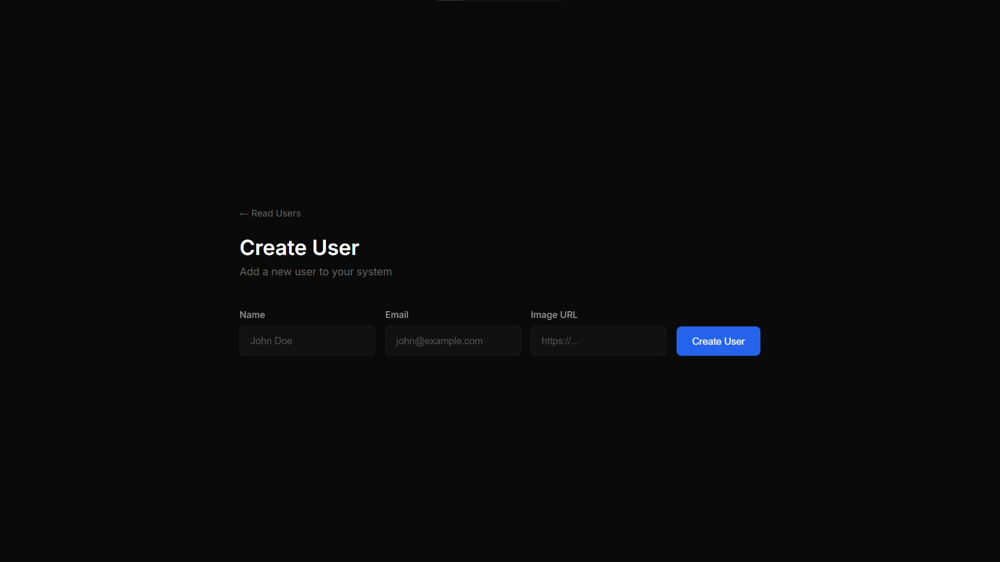

# CRUD-EJS Application

A full-stack web application built with Node.js, Express.js, EJS templating engine, and MongoDB for user management operations.

## 🚀 Features

- **Create Users**: Add new users with name, email, and image URL
- **Read Users**: Display all users in a clean, organized layout
- **Update Users**: Edit existing user information
- **Delete Users**: Remove users from the database
- **Responsive Design**: Modern UI with CSS styling
- **Real-time Database**: MongoDB integration for data persistence

## 🛠️ Technologies Used

- **Backend**: Node.js, Express.js
- **Database**: MongoDB with Mongoose ODM
- **Frontend**: EJS templating engine
- **Styling**: Custom CSS
- **Development**: Nodemon for auto-restart

## 📋 Prerequisites

Before running this application, make sure you have the following installed:

- [Node.js](https://nodejs.org/) (v14 or higher)
- [MongoDB](https://www.mongodb.com/try/download/community) (running locally on port 27017)

## 🚀 Installation

1. **Clone the repository**
   ```bash
   git clone <repository-url>
   cd crud-ejs
   ```

2. **Install dependencies**
   ```bash
   npm install
   ```

3. **Start MongoDB**
   Make sure MongoDB is running on your local machine:
   ```bash
   mongod
   ```

4. **Start the application**
   ```bash
   node index.js
   ```
   
   Or with nodemon for development:
   ```bash
   npx nodemon index.js
   ```

5. **Access the application**
   Open your browser and navigate to `http://localhost:3000`

## 📁 Project Structure

```
crud-ejs/
├── index.js             # Main server file
├── models/
│   └── user.js          # User model schema
├── views/
│   ├── create.ejs       # Create user form
│   ├── read.ejs         # Display all users
│   └── edit.ejs         # Edit user form
├── public/
│   ├── stylesheets/
│   │   ├── create.css   # Create page styles
│   │   ├── read.css     # Read page styles
│   │   └── edit.css     # Edit page styles
│   ├── javascripts/     # Client-side scripts
│   └── images/          # Static images
├── package.json         # Project dependencies
└── README.md            # This file
```

## 🎯 API Endpoints

| Method | Endpoint | Description |
|--------|----------|-------------|
| GET | `/` | Display create user form |
| POST | `/create` | Create a new user |
| GET | `/read` | Display all users |
| GET | `/edit/:id` | Display edit form for specific user |
| POST | `/edit/:id` | Update user information |
| GET | `/delete/:id` | Delete a user |

## 💾 Database Schema

The application uses a simple User model with the following fields:

```javascript
{
  name: String,    // User's full name
  email: String,   // User's email address
  image: String    // URL to user's profile image
}
```

## 🎨 Features Overview

### Create User
- Form with name, email, and image URL fields
- Client-side validation
- Automatic redirect to read page after creation

### Read Users
- Displays all users in a card layout
- Shows user image, name, and email
- Edit and delete buttons for each user

### Edit User
- Pre-populated form with existing user data
- Update user information
- Maintains data integrity

### Delete User
- One-click user deletion
- Automatic page refresh after deletion

## 🔧 Configuration

The application connects to MongoDB using the following configuration:
- **Database**: `CrudEjs`
- **Host**: `localhost`
- **Port**: `27017`

To change the database connection, modify the connection string in `models/user.js`:

```javascript
mongoose.connect('mongodb://localhost:27017/YourDatabaseName')
```

## 🚀 Run

To Run this application:

1. Set up a MongoDB database (local or cloud)
2. Update the connection string in `models/user.js`
3. Install dependencies: `npm install`
4. Start the server: `node index.js`
5. Configure your web server (nginx, Apache) to proxy requests to port 3000

## 🤝 Contributing

1. Fork the repository
2. Create a feature branch: `git checkout -b feature-name`
3. Commit your changes: `git commit -am 'Add feature'`
4. Push to the branch: `git push origin feature-name`
5. Submit a pull request

## 📝 License

This project is licensed under the ISC License.

## 👨‍💻 Author
<p align="center">
Created with ❤️ using Node.js, Express, and EJS.
</p>

---
